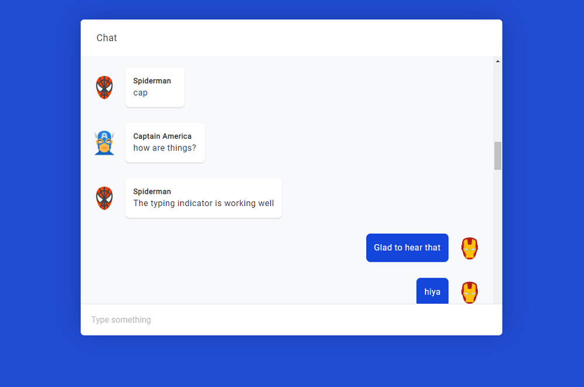

# CometChat User Interface for React App

A library of React components created to speed up the development of CometChat React apps.

## Installation

```bash
npm install react-chatbox-component
```

## Example

You can run a local copy of this repo by following these steps:

* Download or clone this repository
* In the `react-chatbox-component` directory, run `npm install`
* run `npm start`

The application entry point is located in `src/examples/App.js` while the library is in `src/lib/` directory.

## Available Components

### ChatBox



The ChatBox component has the following props:

* `messages` _(array)_ - array of messages to render inside the chat interface. 
* `onSubmit` _(function)_ - function to execute when user submit a new message
* `isLoading` _(boolean)_ - display a loading screen when the value is `true`
* `user` _(object)_ - the currently logged in user. Used to differentiate message bubble color. 
* `renderMessage` _(optional)_ _(function)_ - optional function to render chat bubbles. 
* `typingListener` _(optional)_ _(function)_ - optional function executed when user is typing. 
* `typingIndicator`_(optional)_ _(element)_ - JSX element to render at the bottom of chat interface. Used to show that a user is typing 

```js
import {Chat} from 'react-chatbox-component';

<Chat
  messages={messages}
  onSubmit={this.handleSubmit}
  isLoading={isLoading}
  user={user}
/>
```
